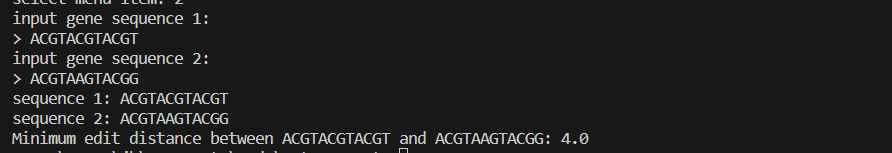

# AutoCorrect
---
This library consists of a Python code implementation of the autocorrect algorithm from scratch, utilizing dynamic programming techniques without reliance on external libraries (except for NumPy).

The functions provided in utils.py offer a set of corrections for any input word by employing dynamic programming to compute the costs associated with transforming one word into another, while also tracking the steps taken to achieve this transformation.

This approach is not limited to spell checking; it can also find applications in various fields, such as mathematical biology. example in gene sequencing tasks.

## correct word suggestion preview

## gene sequencing preview
